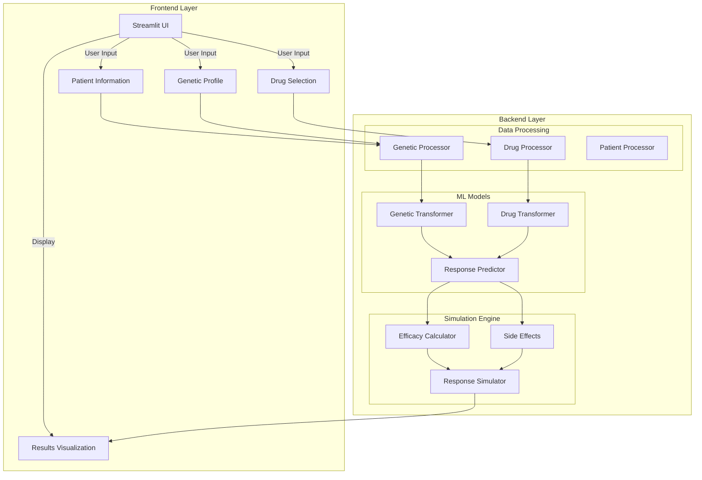
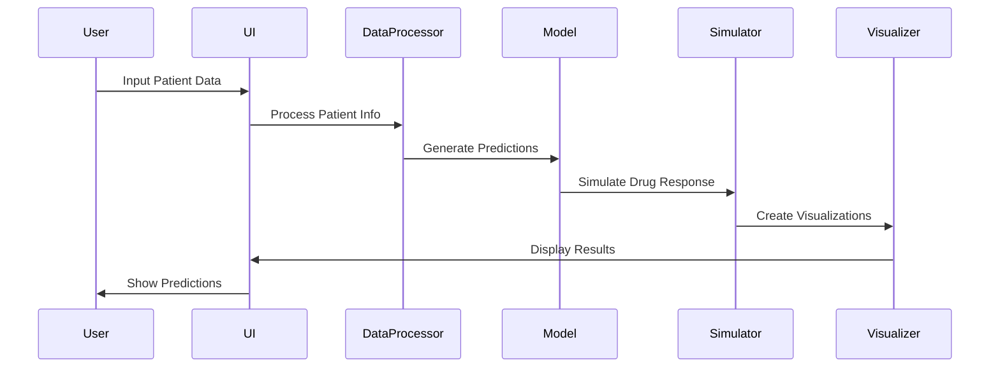
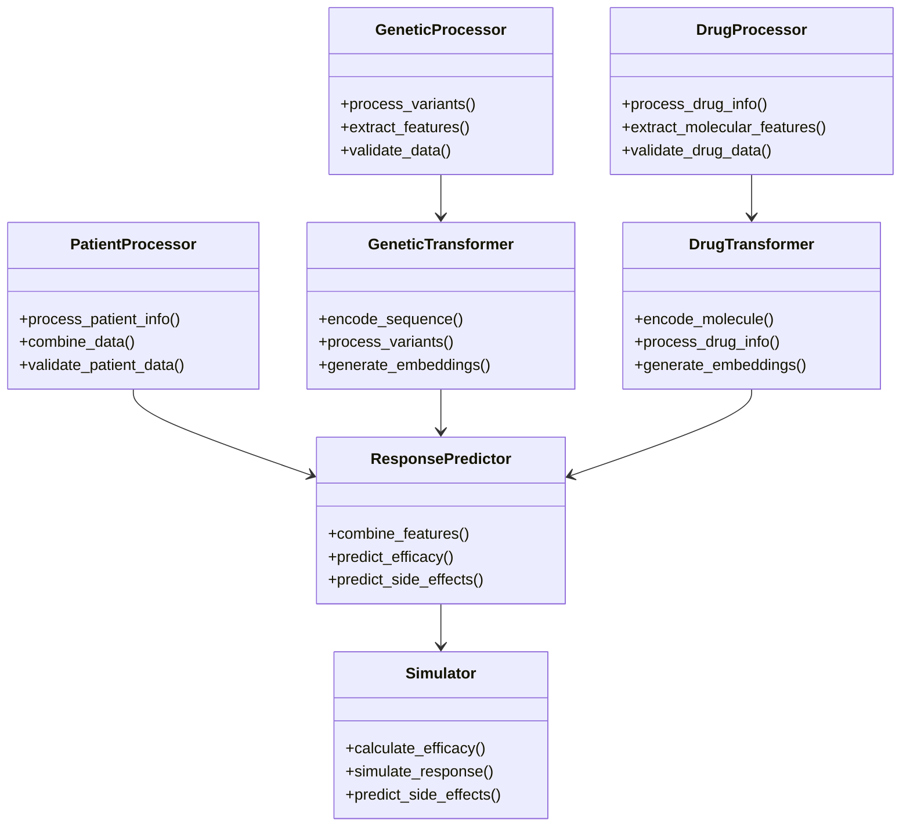
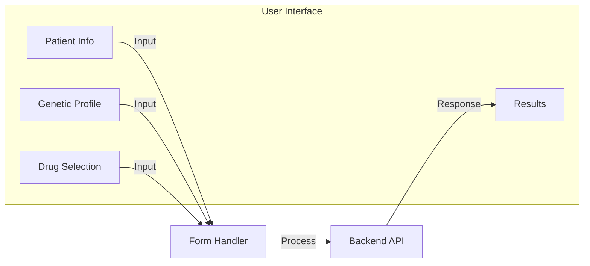
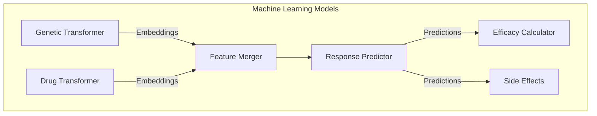
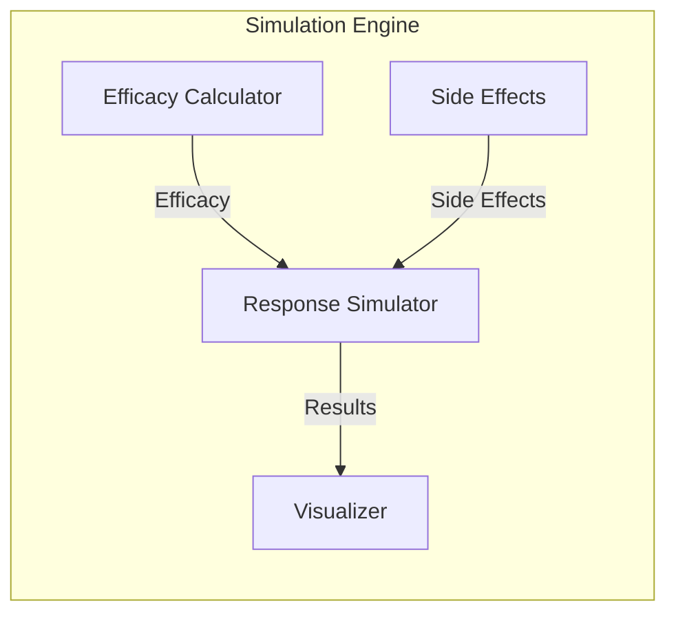
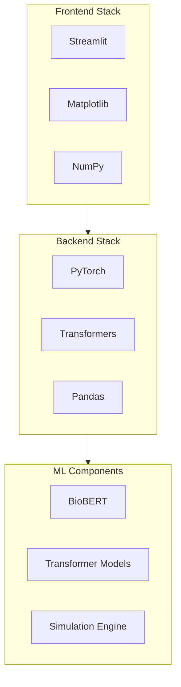
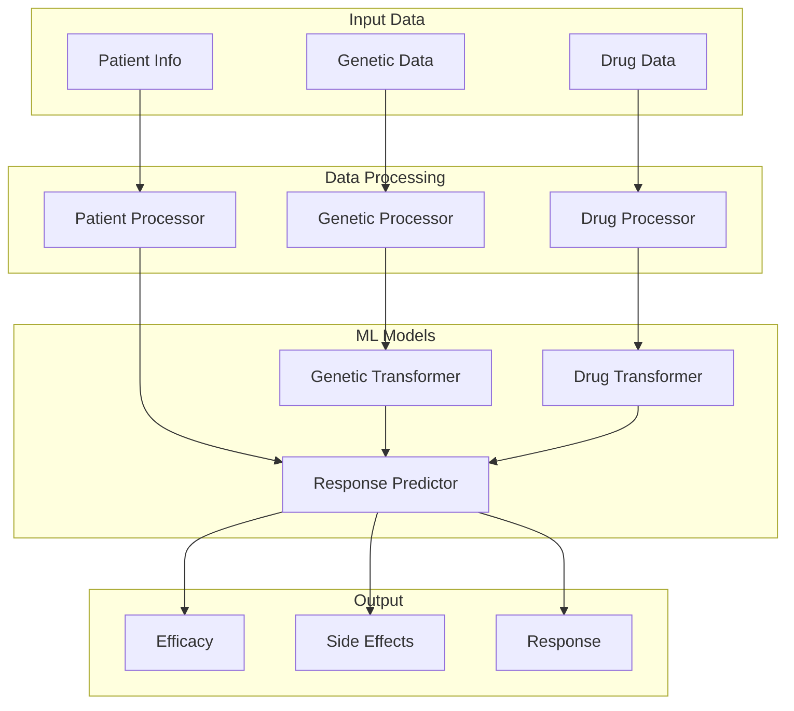
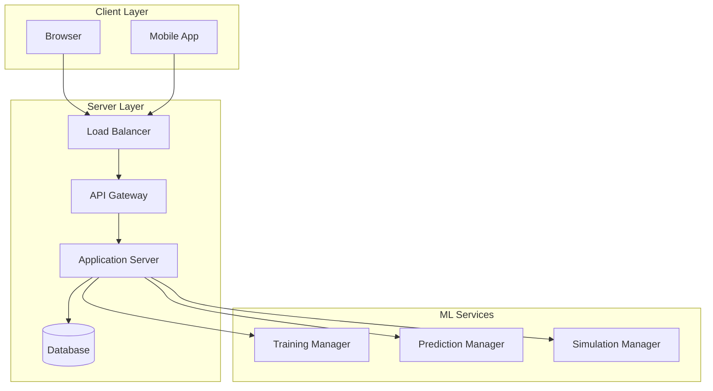

# Personalized Drug AI - Detailed Architecture

## System Overview



## Data Flow Architecture



## Component Architecture



## System Components

### 1. Frontend Layer


### 2. Data Processing Layer
```mermaid
graph TD
    subgraph DP["Data Processing"]
        G[Genetic Data]
        D[Drug Data]
        P[Patient Data]
        
        G --> GP[Genetic Processor]
        D --> DP[Drug Processor]
        P --> PP[Patient Processor]
        
        GP --> FE[Feature Extraction]
        DP --> FE
        PP --> FE
        
        FE --> VD[Validation]
        VD --> PE[Preprocessing]
    end
```

### 3. Model Layer


### 4. Simulation Layer


## Technical Stack



## Data Flow Details



## Deployment Architecture

